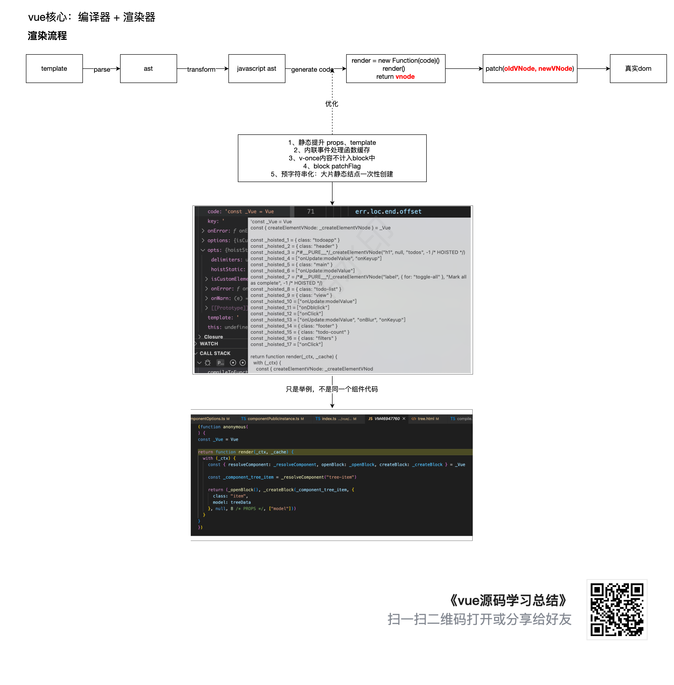
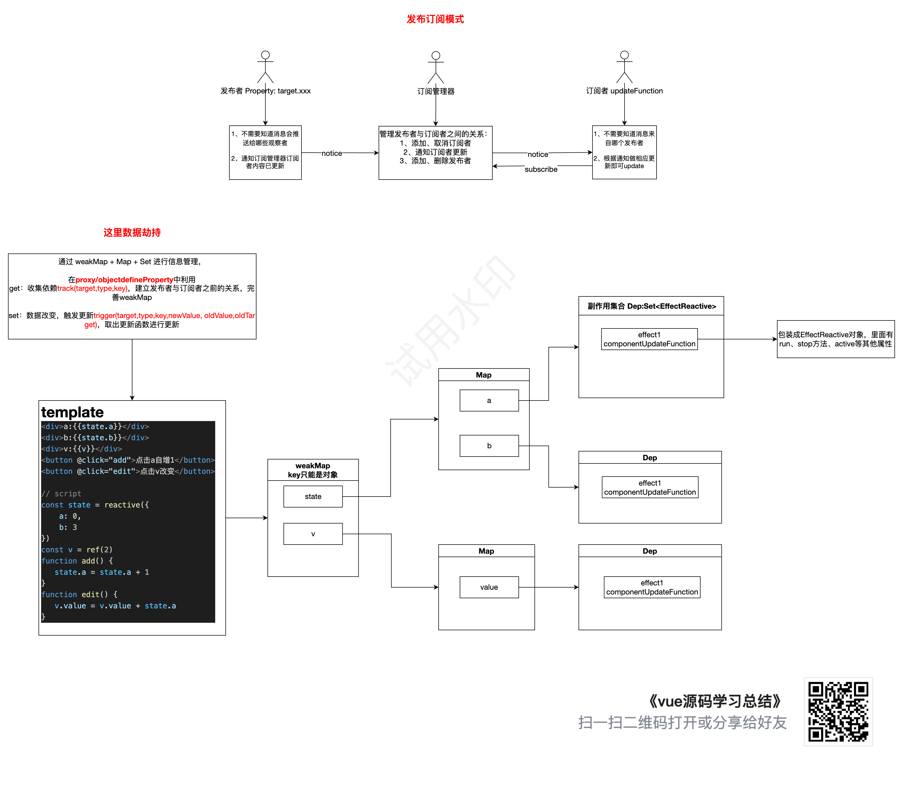
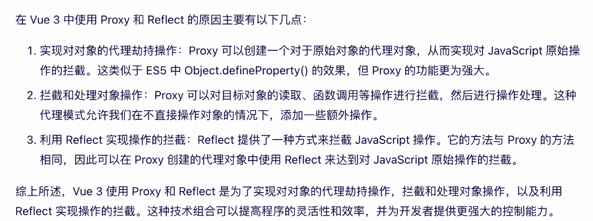
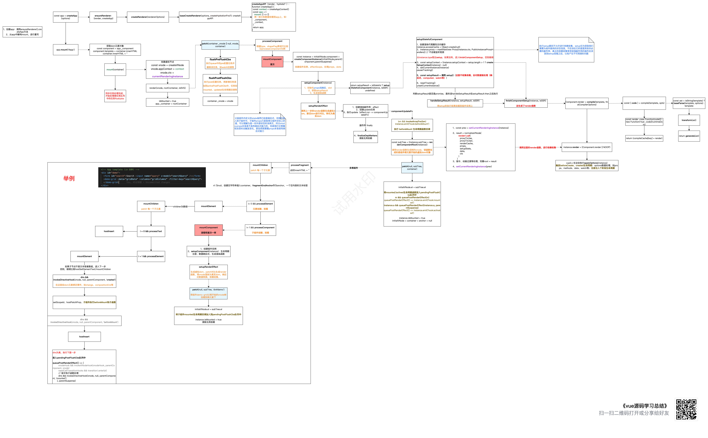
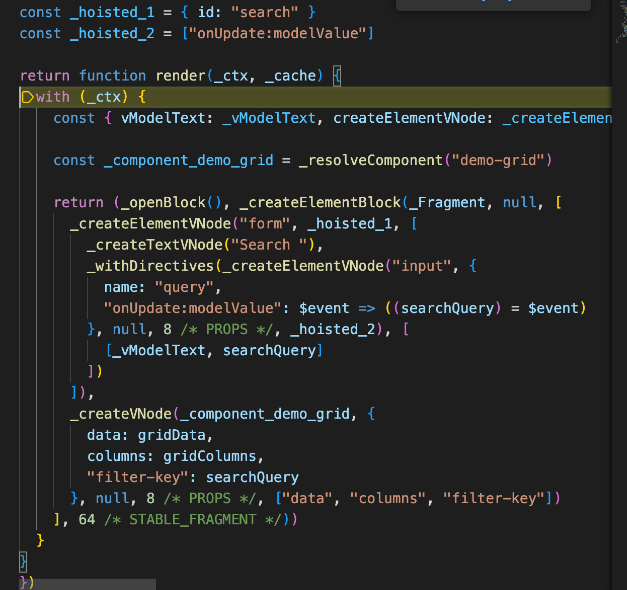
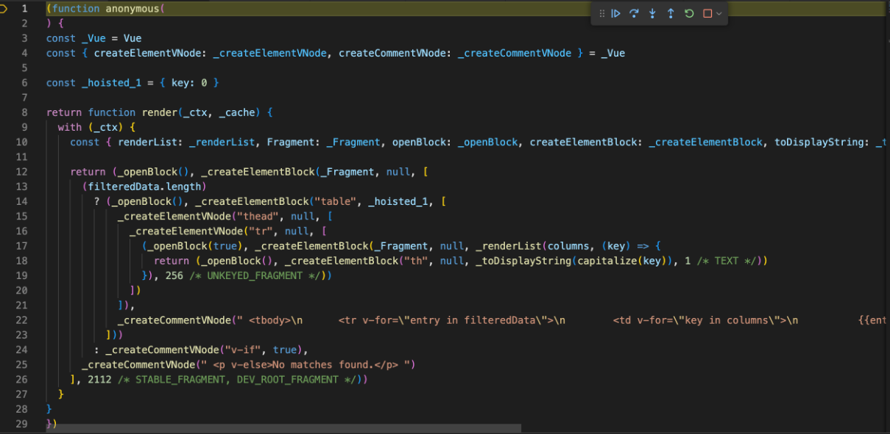
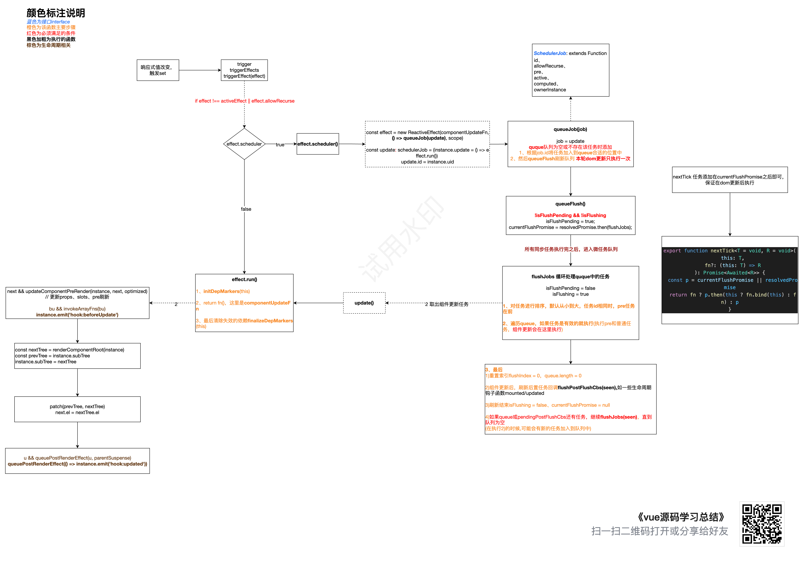

# vue3-mind

vue3 学习笔记

[详细内容在腾讯文档](https://docs.qq.com/doc/DYlRYU0thaFp2QmdP)

## 一、vue 核心 && 双向绑定原理

### vue 核心实现

简单实现在 js/model.js 中


### 双向绑定原理





1. proxy: **对对象进行拦截处理**，可以在拦截过程中做其他的处理，用于扩展 js 语言的功能
2. reflect：es6 提供的全局对象，**对对象本身进行操作**。包括创建、读取、删除属性等操作

3. 代码应用在 js/model.js 中

## 二、effect

### 收集依赖的逻辑（开始收集、暂停收集，当前激活的副作用设置时机）

1. 默认允许收集
2. 在所有的生命周期钩子中禁止收集，因为他们可能被内部的 effect 调用
3. 获取 setupResult、执行 flushPreFlushCbs 前先暂停收集，再恢复
4. 执行数组方法 ['push', 'pop', 'shift', 'unshift', 'splice'] 时，先暂停收集，再恢复
5. trackEffects 函数中，默认不收集依赖，当 dep 中没有当前激活的副作用，或者（dep 之前没被收集过，新收集的依赖中也没有），shouldTrack 为 true
6. 当执行 effect.run 时,激活 activeEffect，开始允许收集，当副作用函数 fn 执行结束，清空无用依赖后，activeEffect 指向副作用栈中的下一个，shouldTrack 恢复到上一次的状态
7. enableTracking 源码中没用到

### 什么时候允许递归

1. 在 beforeUpdate、beforeMount、pre-lifecycle 生命周期钩子中不允许递归、组件渲染副作用允许递归更新

### 收集依赖、触发更新的逻辑

#### 收集依赖：

1. shouldTrack && activeEffect 为真时收集
2. 不同情况收集的处理：https://zhuanlan.zhihu.com/p/614468288

#### 触发更新：

1. 默认先执行有 computed 属性的副作用，再执行剩余的副作用
2. 当要执行的副作用不是当前激活的副作用（如果是会陷入死循环）或者副作用允许递归
   如果有 scheduler，直接执行 scheduler，没有，执行 run

## 三、首次渲染

### 首次渲染



### 根组件 render



### 子组件 render



## 四、异步渲染、组件更新



### 父子组件更新销毁生命周期执行流程

1.  父 bc -> 子 bc -> 子 c -父 c
2.  子 bc - 子 c - 子 bm - 子 m
3.  父 bu - 子 bu - 子 u - 父 u
4.  父 bum - 子 bum - 子 um - 父 um

### nextTick

1. 在回调中获取更新后 dom 元素
2. 原理：currentPromise.then 后获取，保证在组件渲染后获取

### scheduler 调度逻辑

1. scheduler：

- https://zhuanlan.zhihu.com/p/545063276?utm_id=0
- https://zhuanlan.zhihu.com/p/545063276?utm_id=0

2. 为什么生命周期可以从子执行到父：

- 生命周期里的回调任务没有 id，无法排序，所以就按照加入队列的顺序执行

3. 队列执行顺序以及常见任务类型

- 先执行 quque 中的任务
  - quque 中的任务允许插队：
    - 没有 id，直接 push
    - 如果任务 id 相同，pre 优先
    - 任务 id 不同，按 id 大小排序，插入到对应位置，保证父子组件更新的正确性
- 执行 pre 任务(如 watch)，执行完一个任务后从队列中删除
- 执行执行普通任务（如组件更新函数）
- 最后执行 post 任务(如 watcheffect、生命周期钩子如 created、mounted 等），根据 id 大小排序

4. updateComponentPreRender

- 组件自身状态改变或主动调用 processComponent 时进入
- https://frontend.devrank.cn/traffic-information/7219632397069928508

## 五、dom diff


### 最长递增子序列算法

```
1、https://github.com/Geekhyt/javascript-leetcode/issues/49
2、统计新序列中每个元素与索引的关系const map = newIndexMap
3、maxIndexSoFar = 0，moved = false，newIndex，newIndexToOldIndexMap = []
4、遍历旧序列，在新序列中找对应的newIndex（旧节点在新序列中的索引）
a)如果不存在则将元素删除，如果当前索引大于新序列长度，则将旧序列剩下的元素都删除
b)如果索引存在
i)更新newIndexToOldIndexMap（新序列中每个元素在旧序列中的索引映射（旧索引 + 1），默认为0，代表旧序列中不存在该元素）
ii)更新maxIndexSoFar（当前递增子序列最后一个元素索引）
iii)更新moved。如果newIndex <= maxIndexSoFar, moved = true（是否需要移动元素）（元素发生了移动：顺序遍历旧序列，如果相对位置未发生变化时，newIndex应该比maxIndexSoFar大）
5、找出newIndexToOldIndexMap中最长递增子序列increaseSequence，即不需要移动的元素（二分法 + 贪心算法）
a)p：原数组中每个元素第一个比本身小的元素索引
b)result：递增序列
c)u、v：记录result两端，便于二分查找元素
d)当元素比result中最后一个元素大时，将该元素push进去，修改p
e)当小于最后一个元素时，找出第一个大于等于该元素的索引，替换他，修改p
f)倒叙回溯，更正不正确的索引
6、倒序遍历新序列，令j = increaseSequence.length - 1，
a)元素在newIndexToOldIndexMap中的值为0，说明是新增元素，mount
b)否则，如果moved为true
i)如果是不稳定序列（j<0 || increaseSequence[j] !== i），则移动元素，
ii)否则让j向前移动一位

```

### block

- block：vue3 的一种优化手段，dom diff 时，可以只比较 dynamicChildren 中的结点元素
- v-if、v-for、v-elseif、组件会被视为动态结点
- ast：parseFor->souce.type && source.contentType 决定是否是动态结点
- patch 找父节点：

```js
      // Determine the container (parent element) for the patch.
      const container =
        // oldVNode may be an errored async setup() component inside Suspense
        // which will not have a mounted element
        oldVNode.el &&
        // - In the case of a Fragment, we need to provide the actual parent
        // of the Fragment itself so it can move its children.
        (oldVNode.type === Fragment ||
          // - In the case of different nodes, there is going to be a replacement
          // which also requires the correct parent container
          !isSameVNodeType(oldVNode, newVNode) ||
          // - In the case of a component, it could contain anything.
          oldVNode.shapeFlag & (ShapeFlags.COMPONENT | ShapeFlags.TELEPORT))
          ? hostParentNode(oldVNode.el)!
          : // In other cases, the parent container is not actually used so we
            // just pass the block element here to avoid a DOM parentNode call.
            fallbackContainer


```

- 具体逻辑：利用栈
  - 全局有一个 blockStack 栈，存储所有动态结点
  - 当结点是动态结点时，
    - 1、先执行 openBlock 方法，根据 disableTracking 初始化 currentBlock，currentBlock = disableTracking ? null : [];并将 currentBlock 放到栈中，
    - 2、然后执行 createVNode 方法，该方法内部是 setupBlock(createVNode()),在先执行参数重的方法，再执行外部 setupBlock 方法。在 createVnode 中，创建 vnode，结点创建从最低向外执行。结点创建完成后，根据一些条件判断是否是动态结点，如果是，放入 currentBlock 中，收集完之后返回 vnode，接着进入 setupBlock，此时，结点的动态结点都已收集完成，将 currentBlock 挂载在 vnode.dynamicChildren 上，再从 blockStack 栈中弹出，此时 currentBlock 指向父级，如果 vnode 也是动态结点，就将其加入父级 currentBlock 中

```js
// 大概逻辑
// https://www.zhuxianfei.com/jishu/js/59773.html
// https://blog.csdn.net/qq_33635385/article/details/126955603
// https://blog.csdn.net/pfourfire/article/details/125387484

// Since v-if and v-for are the two possible ways node structure can dynamically change, once we consider v-if branches and each v-for fragment a block, we can divide a template into nested blocks, and within each block the node structure would be stable. This allows us to skip most children diffing and only worry about the dynamic nodes (indicated by patch flags).

export const blockStack: (VNode[] | null)[] = [] // 所有层的block
export let currentBlock: VNode[] | null = null // 每一层block
dynamicChildren: VNode[] | null

// 1、必须在createBlock前调用
// 2、v-for的时候disableTracking为true 即不收集 一直需要diff
export function openBlock(disableTracking = false) {
  blockStack.push((currentBlock = disableTracking ? null : []))
}

//更改currentBlock
export function closeBlock() {
  blockStack.pop() // 上一层的收集完了，出栈
  currentBlock = blockStack[blockStack.length - 1] || null// 永远指向栈顶
}

// 是否应该在一个block元素中收集动态子节点，只有当值大于0时才收集
// We are not using a simple boolean because this value may need to be incremented/decremented by nested usage of v-once
export let isBlockTreeEnabled = 1
export function setBlockTracking(value: number) {
  isBlockTreeEnabled += value
}

// 将收集到的动态结点赋值给vnode.dynamicChildren、停止当前结点收集
function setupBlock(vnode: VNode) {
  // save current block children on the block vnode
  vnode.dynamicChildren =
    isBlockTreeEnabled > 0 ? currentBlock || (EMPTY_ARR as any) : null
  closeBlock() // 这里currentBlock已经变成了上一层级的（父级）
  // 当前结点是稳定的动态结点，收集到父级的currentBlock中
    if (isBlockTreeEnabled > 0 && currentBlock) {
    currentBlock.push(vnode)
  }
  return vnode
}

export function createElementBlock(
  type: string | typeof Fragment,
  props?: Record<string, any> | null,
  children?: any,
  patchFlag?: number,
  dynamicProps?: string[],
  shapeFlag?: number
) {
  return setupBlock(
    createBaseVNode(
      type,
      props,
      children,
      patchFlag,
      dynamicProps,
      shapeFlag,
      true /* isBlock */
    )
  )
}

export function createBlock(
  type: VNodeTypes | ClassComponent,
  props?: Record<string, any> | null,
  children?: any,
  patchFlag?: number,
  dynamicProps?: string[]
): VNode {
  return setupBlock(
    createVNode(
      type,
      props,
      children,
      patchFlag,
      dynamicProps,
      true /* isBlock: prevent a block from tracking itself */
    )
  )
}

// 收集动态结点，完善currentBlock
function createBaseVNode(
  type: VNodeTypes | ClassComponent | typeof NULL_DYNAMIC_COMPONENT,
  props: (Data & VNodeProps) | null = null,
  children: unknown = null,
  patchFlag = 0,
  dynamicProps: string[] | null = null,
  shapeFlag = type === Fragment ? 0 : ShapeFlags.ELEMENT,
  isBlockNode = false,
  needFullChildrenNormalization = false
) {
    const vnode = {};

  // 收集动态虚拟结点
  // 值大于0 && 自己不能收集自己 && 有父blcok(currentBlock) &&
  // patchFlag的存在表明此节点在更新时需要打补丁.
  // 组件节点也应该始终进行修补，因为即使组件不需要更新，它需要将实例持久化到下一个vnode，以便以后可以正确地卸载它。
  // EVENTS仅用于水合作用，如果它是唯一的flag，由于处理程序缓存，结点不认为是动态缓存的
  if (
    isBlockTreeEnabled > 0 && !isBlockNode && currentBlock &&
    (vnode.patchFlag > 0 || shapeFlag & ShapeFlags.COMPONENT) &&
    vnode.patchFlag !== PatchFlags.HYDRATE_EVENTS
  ) {
    currentBlock.push(vnode)
  }
  return vnode
}

```
