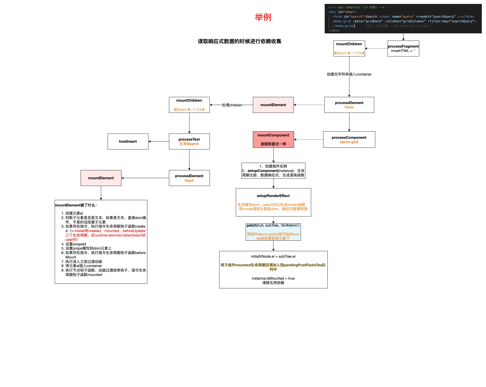
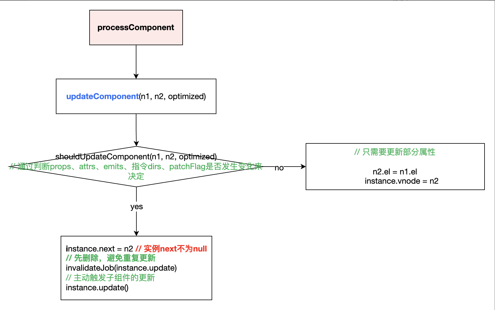
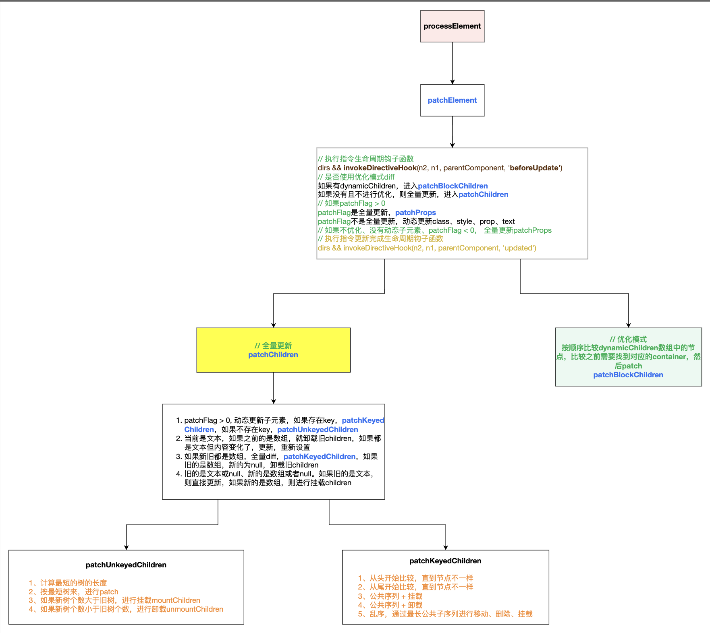
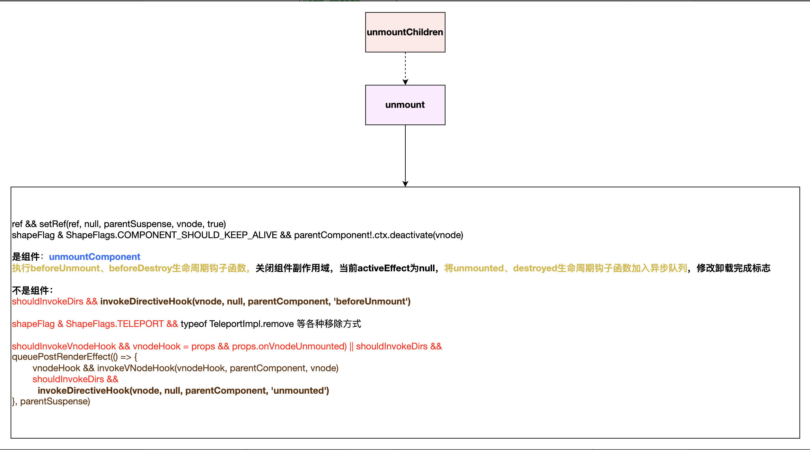

## diff

### patch 流程

- 如果是相同节点，不比较，直接退出
- 如果节点类型不同，卸载旧节点
- 获取新节点 type，进入不同的流程
  - processText
  - processCommentNode
  - 静态节点 && n1 = null：mountStaticNode
  - processFragment
- 默认情况下，判断 shapeFlag
  - processElement
  - processComponent
  - TeleportImpl.process
  - SuspenseImpl.process
- setRef

### 首次 patch



### 更新时 patch 核心方法

- vNode.next
  当组件是被迫更新，不是主动更新时，next 不为 null，在执行组件渲染更新函数时，会先去更新 props、slot、再进行 patch
- processComponent
  
- processElement
  
- unmountChildren
  

### 最长递增子序列

[300. 最长递增子序列](https://github.com/Geekhyt/javascript-leetcode/issues/49)

- 算法逻辑

  - 变量说明

    - maxIndexSoFar = 0（当前递增子序列最后一个元素索引
    - moved = false（是否需要移动元素），
    - newIndex（旧节点在新序列中的索引），
    - newIndexToOldIndexMap = []（新序列中每个元素在旧序列中的索引映射，每个元素值默认为 0，代表节点元素不在旧序列中，如果存在，值为节点在旧序列索引 + 1）

  1.  统计新序列中每个节点元素与索引的关系 const map = newIndexMap
  2.  遍历旧序列，在新序列中找对应的 newIndex

      - 如果新序列中不存在该节点则将元素删除(newIndex < 0)
      - 如果新序列已处理完，旧序列还存在节点（当前遍历的节点索引 oldIndex > 新序列长度），则将旧序列剩下的元素都删除
      - 如果新序列中存在该节点（newIndex > 0）
        - 更新 newIndexToOldIndexMap
        - 更新 maxIndexSoFar
        - 更新 moved。如果 newIndex <= maxIndexSoFar, moved = true（元素发生了移动：顺序遍历旧序列，如果相对位置未发生变化时，newIndex 应该比 maxIndexSoFar 大）

  3.  找出 newIndexToOldIndexMap 中最长递增子序列 increaseSequence，即不需要移动的元素（二分法 + 贪心算法）

      - 变量说明：

        - result：递增序列
        - p：初始值是 newIndexToOldIndexMap，最终结果为递增序列 result 中第一个比数组元素本身小的元素索引值集合
        - u、v：记录 result 两端，便于二分查找元素

      - 当元素比 result 中最后一个元素大时，将该元素 push 进去，修改 p
      - 当小于最后一个元素时，找出第一个大于等于该元素的索引，替换他，修改 p
      - 倒叙回溯，更正不正确的索引
      - 倒序遍历新序列，令 j = increaseSequence.length - 1
        - 元素在 newIndexToOldIndexMap 中的值为 0，说明是新增元素，mount
        - 否则，如果 moved 为 true
          - 如果是不稳定序列（j<0 || increaseSequence[j] !== i），则移动元素
          - 否则让 j 向前移动一位

  ```js
  function getSequence(arr: number[]): number[] {
    const p = arr.slice(); // 原始数组拷贝 每个item表示：第一个比其自身值小的元素的索引
    const result = [0]; // 最长递增子序列元素索引 有序数组
    let i, j, u, v, c;
    const len = arr.length; // 数组长度
    for (i = 0; i < len; i++) {
      const arrI = arr[i];
      if (arrI !== 0) {
        // 递增子序列最后一个元素索引
        j = result[result.length - 1];
        // 说明整体是递增的，直接将索引i接到result后面
        if (arr[j] < arrI) {
          p[i] = j; // 小于arrI的最大值的索引
          result.push(i);
          continue;
        }
        // 如果arrI的值小于递增子序列最后一个值时，利用二分法，在result中找到第一个大于等于他的值的元素索引，并进行替换
        u = 0; // 左指针
        v = result.length - 1; // 右指针
        while (u < v) {
          c = (u + v) >> 1;
          if (arr[result[c]] < arrI) {
            u = c + 1;
          } else {
            v = c;
          }
        }
        // 第一个大于等于arrI的数
        if (arrI < arr[result[u]]) {
          if (u > 0) {
            // 小于arrI的最大值的索引 result[u]被当前值替换，所以比u小的索引u - 1
            p[i] = result[u - 1];
          }
          // 替换 这里可能会存在问题 比如有多个重复的数值在不同的位置，对整体的序列就会存在影响
          result[u] = i;
        }
      }
    }
    // 倒序回溯 用 p 覆盖 result 进而找到最终正确的索引
    u = result.length;
    v = result[u - 1]; // v是递增索引
    // 倒序
    while (u-- > 0) {
      result[u] = v;
      v = p[v]; // 通过p获取递增索引的前一个索引
    }
    return result;
  }
  ```

### vnode && props && directive

1. 创建节点

   - 非动态节点直接创建生成 vNode
   - 动态 block 节点收集（v-if、v-elseIf、v-for、组件）

     - 全局有一个 blockStack 栈，存储所有动态节点

     - 当节点是动态节点时，先执行 openBlock 方法。根据 disableTracking 来初始化 currentBlock 并将 currentBlock 添加到全局栈中，currentBlock 是当前 dom 树的所有动态子节点
     - 然后执行 setupBlock 方法。先执行参数方法创建虚拟节点，创建虚拟节点后，如果当前节点是动态节点，将它添加到 currentBlock 中。（如果 isBlockTreeEnabled 大于 0 && 自己不是 block 元素 && 有父 block(currentBlock) && （patchFlag 的存在表明此节点在更新时需要打补丁 或者是 组件） && 不是水合事件，满足这些条件，说明是动态节点）
     - 继续执行 setupBlock，此时当前层的动态节点收集完毕，将收集到的赋值给 vNode.dynamicChildren，然后从栈中弹出，让 currentBlock 指向父级
     - 如果当前的节点也是动态节点，则把它添加到父级的 currenBlock 中

     ```js
     const vnode = asBlock ? (openBlock(), createBlock(...)): createVNode()

     const openBlock = () => {
       blockStack.push((currentBlock = disableTracking ? null : []))
     }

     const createBlock = setupBlock(createVNode())
     const setupBlock = (vnode) => {
       vnode.dynamicChildren = isBlockTreeEnabled ? currentBlock : null
       closeBlock();
       // 如果当前节点是动态节点 && isBlockTreeEnabled，将它添加到父级的currentBlock中
       // 现在currentBlock已经是父级的了
       currentBlock.push(vnode)
     }
     const createVnode = () => {
       const vnode = {};
       // 如果是动态节点，将vnode添加到currentBlock中
       // 如果 isBlockTreeEnabled 大于 0 && 自己不是 block 元素 && 有父 blcok(currentBlock) && patchFlag 的存在表明此节点在更新时需要打补丁 && 不是水合事件，满足这些条件，说明是动态节点
     }
     const closeBlock = () => {
       blockStack.pop();
       currentBlock = blockStack[blockStack.length - 1]
     }
     ```

2. 组件 props 设置

   - 组件实例中 propsOptions 标准化、props 初始化设置

     - 标准化 propsOptions（见首次渲染图）
     - props 初始化设置 initProps、setFullProps（见首次渲染图）

   - props 的更新 updateProps

     - 如果是 PatchFlags 是 PatchFlags.PROPS, 则只更新动态 props 的值。
     - 如果当前组件的 PatchFlags 是 PatchFlags.FULL_PROPS, 这时候先执行 setFullProps 流程，然后删除掉不再使用的动态 props。

   - 渲染到真实 dom 元素上 patchProps（style、class、event、其他 attribute 属性）
     

3. [directive](./directive.md)
