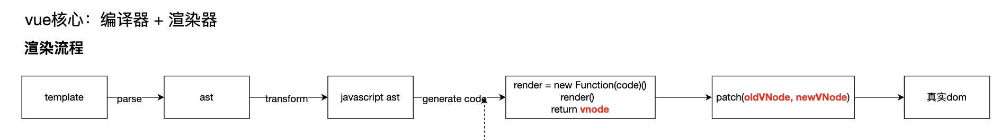
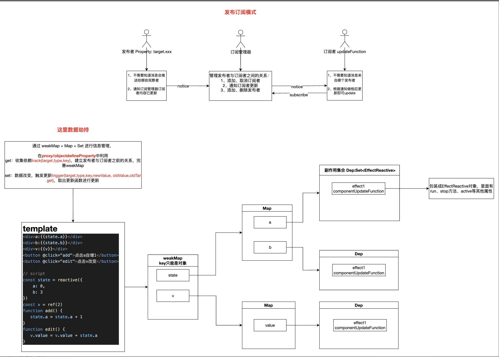

## vue 源码分析

### 一、目录结构

项目使用 monorepo 模式：在一个仓库中管理多个子项目，所需依赖在主项目安装，不需要在每个子项目都安装一遍。

优势：

- 集中管理，减少了维护和管理多个代码库的成本
- 代码复用，多个项目共享一个代码库，避免重复编码
- 提升协作效率
- 统一构建
- 项目只有一个版本
- 可以快速定位问题

劣势：

- 项目体积巨大

### 二、整体实现：编译器 + 渲染器

通过编译器对 vue 模版进行解析最终生成渲染函数，在渲染器中使用渲染函数生成虚拟 dom，再通过 patch 对比将虚拟 dom 渲染为真实 dom

### 三、双向绑定原理

> - 业务需求：在页面中展示车票剩余总数的实时数据
> - 实现逻辑：每当总数改变，就得重新渲染，更新 dom 属性值

- **响应式数据和副作用**

  - 当数据的改变总会使得某些事件重新执行时，在 vue 中，这类数据定义为响应式数据
  - 数据改变引发的重新渲染，类似这种影响的不止有本身的函数称之为副作用函数。该副作用不需要开发人员手动触发，全部交由框架处理。

- **实现：发布订阅模式 + 数据拦截**
  

  - 数据拦截。利用 JS API 在属性描述符中拦截：在 getter 中收集依赖，在 setter 中触发依赖相关副作用。

    - vue3 中使用 Proxy

      - 避免直接修改源对象，产生 bug：通过 Proxy 对目标对象做代理，后续对代理对象进行操作，然后通过 Reflect 对源对象进行修改

        1. proxy: **对对象进行拦截处理**，可以在拦截过程中做其他的处理，用于扩展 js 语言的功能

        2. reflect：es6 提供的全局对象，**对对象本身进行操作**。包括创建、读取、删除属性等操作

      - Proxy 功能比 Vue2 中 Object.defineProperty 更强大
      - 解决了 vue2 中不能监听对象属性的增删、不能监听数组的变化（对于数组索引和长度的变化无法直接监听）、不支持 Map、Set、WeakMap、WeakSet 的问题

- 通过`weakMap<Target<Object>，Map<Target.key, <Set<Effect>>>>`存储响应式数据和副作用函数之间的联系。

  - weakMap 不会阻止垃圾回收器对 Target 的回收，它比 Map 更省内存，当无对象引用 Target 时，该对象就被回收走了。也可以避免循环引用导致的内存泄露问题

### 三、**响应式 API**

- [reactive](./reactive.md)
- [ref](./ref.md)

### 四、渲染、依赖收集

- [渲染流程](./render.md)
- [依赖收集](./effect-依赖收集与触发.md)
- [watch](./watch.md)
- [computed](./computed.md)
- [scheduler 参考文章，具体总结在流程图中](https://zhuanlan.zhihu.com/p/545063276?utm_id=0)

  - 队列执行顺序以及常见任务类型
    - 先执行 quque 中的任务
      - quque 中的任务允许插队：
        - 没有 id，直接 push
        - 如果任务 id 相同，pre 优先
        - 任务 id 不同，按 id 大小排序，插入到对应位置，保证父子组件更新的正确性
    - 执行 pre 任务(如 watch)，执行完一个任务后从队列中删除
    - 执行执行普通任务（如组件更新函数）
    - 最后执行 post 任务(生命周期钩子如 created、mounted 等），根据 id 大小排序
  - nextTick
    1. 在回调中获取更新后 dom 元素
    2. 原理：currentPromise.then 后获取，保证在组件渲染后获取

### 五、[diff](./diff.md)

### 六、父子组件更新销毁生命周期执行流程

1.  父 bc -> 子 bc -> 子 c -父 c
2.  子 bc - 子 c - 子 bm - 子 m
3.  父 bu - 子 bu - 子 u - 父 u
4.  父 bum - 子 bum - 子 um - 父 um

### 参考

- [Vue.js 设计与实现](https://weread.qq.com/web/reader/c5c32170813ab7177g0181ae)
